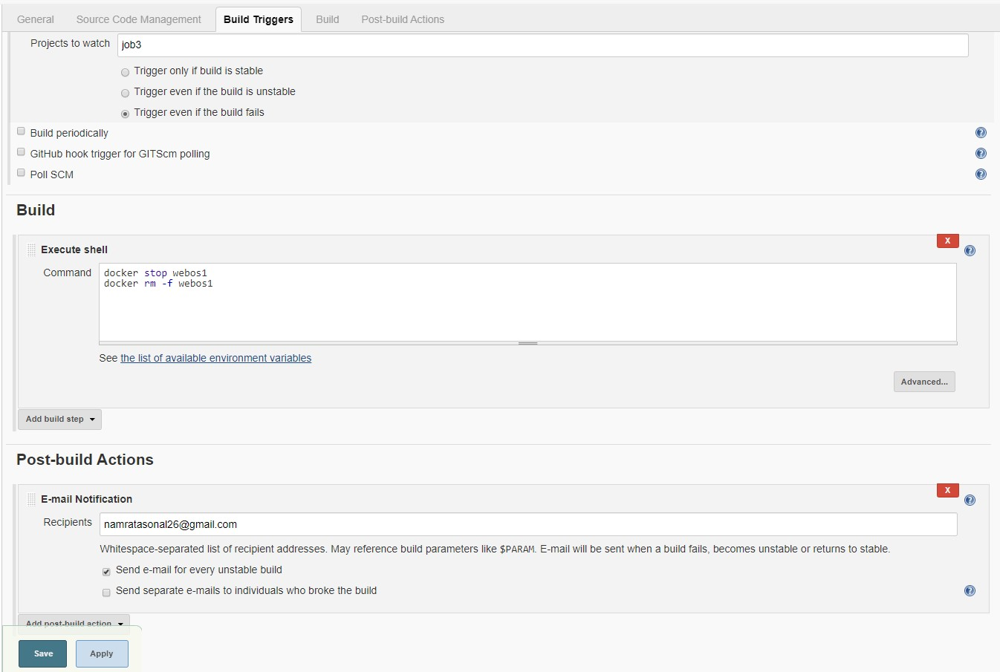

# Jenkins&Docker both in the same Docker !!!

## Task 1 
### Create container image that’s has Jenkins installed  using dockerfile
Problem in this task - If we installed jenkins then it is not able to launch docker in the same container . 
So to solve this first we have to launch **docker in docker** and create an image of this.
**Step 1 -** First install docker in a centos:7 container and them commit it to yash6899/dockerindocker image
**> ** So first run the docker run command to launch a container

** > ** Configure the yum to install docker in it - vi /etc/yum.repos.d/docker.repo

** > ** Now install the docker-ce - yum install docker-ce -y

** Note - ** In this container docker does not work we are creating this container to commit a image in which docker is already installed.
** > ** After installation commit this container to a new os

** > ** Now create a Dockerfile to build a new image in which jenkins is also installed from the image we have just committed.


Now the image is ready with jenkins and docker both installed in it.
```
```
## Task 2
### When we launch this image, it should automatically starts Jenkins service in the container.

** > ** In this command we are mounting /var/run/docker.sock:/var/run/docker.sock so that we can use the docker daemon of the redhat inside the container.
** > ** And -p 8999:8080 so that we can access jenkins from the redhat ip on port 8999.
** > ** After this you can go to your baseOS ip on port 8999 there you see a screen like this - 

** > ** After this to get the first time password first execute the bash command from that container - 

** > ** And then run the following command inside the container to read the password - 

** > ** Now the jenkins is ready now configure the jenkins and install plugins for github and build-pipeline
```
```
## Task 3
### Create a job chain of job1, job2, job3 and  job4 using build pipeline plugin in Jenkins .
### Job1 - Pull  the Github repo automatically when some developers push repo to Github.

### Job2 - By looking at the code or program file, Jenkins should automatically start the respective language interpreter install image container to deploy code ( eg. If code is of  PHP, then Jenkins should start the container that has PHP already installed ).

### Job3 - Test your app if it  is working or not.

### Job4 - If app is not working , then send email to developer with error messages.

### Job5 - If container where app is running. fails due to any reson then this job should automatically start the container again.

```
```
** > ** Now the chain of job is created you can add that to your build pipeline and see a structure like this when you push something in your github repo but for this you first need to create a webhook for this -

```
```
The task is completed , the main challenge in this project is to launch ** docker inside the docker ** and ** jenkins inside the docker **.
```
```
@all-contributors add @ash6899
@all-contributors add @sonaagar
```
```
<a href="https://github.com/yashkhandelwal17/Practice/graphs/contributors">
  
</a>

